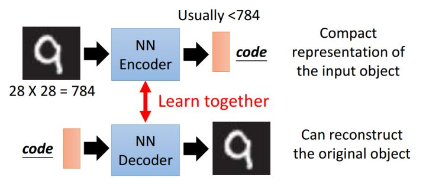
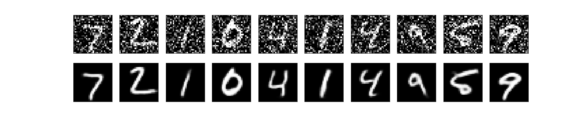

自编码器是一种无监督学习方法，可用于数据降维及特征抽取。自编码器由编码器（Encoder）和解码器（Decoder）两部分组成。编码器通常对输入对象进行压缩表示，解码器对经压缩表示后的code进行解码重构。

去除噪点的效果：

### 参考资料
- [keras-autoencoder](https://blog.keras.io/building-autoencoders-in-keras.html)
- [deep auto-encoder](https://zhuanlan.zhihu.com/p/33088428)

