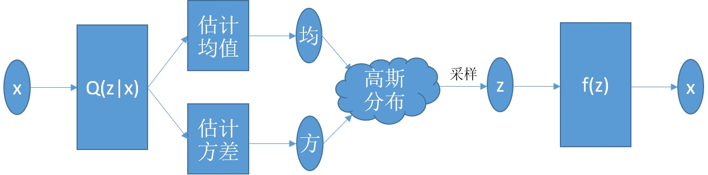

VAE，全称variational autoencoder， 是一种重要的生成模型，与autoencoder相比，它不是生成原图，而是可以生成和原图相似的新图片。

在 VAE中，它的Encoder有两个，一个用来计算均值，一个用来计算方差。

### 参考资料
- [VAE](https://zhuanlan.zhihu.com/p/25269592)
- [VAE-苏剑林](https://zhuanlan.zhihu.com/p/34998569)
